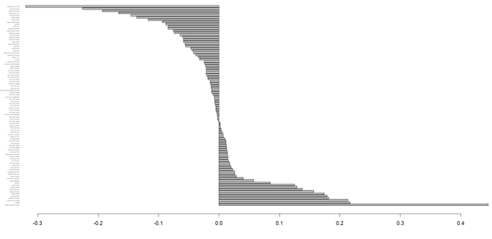
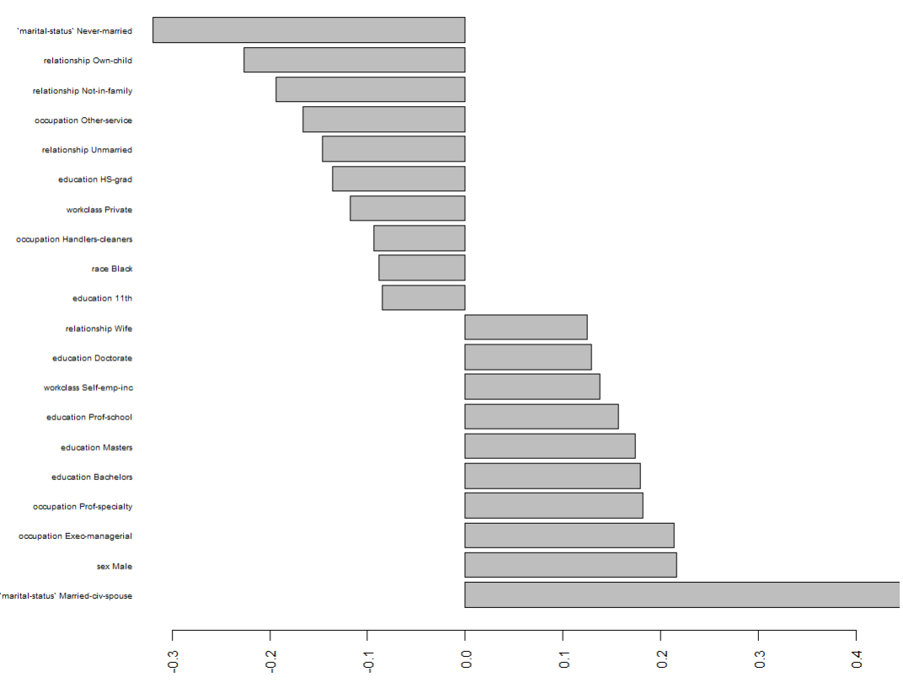

# Predicting Income Class from Census Data

## Authors  

*Isaiah Chastain, Derek Nelson, Lucas Dowlen, Ryan Naleway, and Dylan Smith*

## Report  

### **1. Problem Statement and Background**  

In this project, we will be analyzing census data from the 1994 United States Census found online in the UCI Machine Learning Repository.  The purpose of this analysis is to determine if a person’s income class may be predicted based off other factors shown in the dataset. The models built from our analysis will be tested on pre-partitioned test data from the same dataset to get a measure of accuracy (more on this in the “Results” section).  
*Authors: Isaiah Chastain (50%), Dylan Smith (50%)*  

### **2. Data and Exploratory Analysis**  

The dataset we have been given has the following columns:  
| Column Name    | Description |
| -----------    | ----------- |
| age            | Age of the people described in this row |
| workclass      | Their employment status/employer|
| fnlwgt         | The sampling weight – how many people are represented by the other statistics described in this row |
| education      | Education level of the people described in this row |
| education-num  | A numerical representation of this row’s education level |
| marital-status | Marital status and if their spouse is in the military |
| occupation     | What they do for work |
| relationship   | What are they in their family |
| race           | What race are they |
| sex            | What is their sex |
| capital-gain   | Monetary gain through sale of assets |
| capital-loss   | Monetary loss through sale of assets |
| hours-per-week | How many hours worked in a week |
| native-country | What country are they from |
| class          | Whether the people described by this row make less than or equal to $50K annually, or more than $50K annually |  

One important thing to note is that in the original dataset, the NA values were not filled with NA, they were filled with “ ?”. Our first step was to convert these question marks into NA’s using lapply and an ifelse branch. Secondly, we realized that all of our NA values were in columns that contained categorical values, not numerical. For this reason, and the fact that our dataset is very large, we chose to simply drop the NA values instead of imputing data into them.  The only data that we generated (or transformed, more so), was our class column. Instead of having the char datatype categories “<= $50K” and “>$50K”, we converted these values to FALSE and TRUE logical values respectively. This dataset has many outliers, however, for the most part these outliers are not errors – they are simply natural outcomes of capitalism.  This dataset does seem to max out at $99,999 for values that may possibly be greater than $99,999 in the “capital-gain” column. After cleaning our data, we created a correlation matrix to see which factors tended to affect the probability an instance being “class = TRUE” (the person represented by the data makes more than $50K a year). We found that the three most impactful coefficient correlations were: marital-status = Married-civ-spouse (+0.445), marital-status = Never-married (-0.32), and relationship = Own-child (-0.226). Here is the full correlation graph:  
  
  
  
As these legends are too small to read, here is a graph of the 10 most positive and 10 most negative correlations:   
  
  
  
This concludes our introductory exploratory data analysis.  
*Authors: Isaiah Chastain (25%), Dylan Smith (25%), Lucas Dowlen (25%), Ryan Naleway (25%)*  

### **3. Appendix**  

Dataset: [UCI Adults Dataset](https://archive.ics.uci.edu/dataset/2/adult)  
Github Repo: [Project Repo](https://github.com/IsaiahStain05/CSC-3220-Project.git)  
*Author: Isaiah Chastain (100%)*
